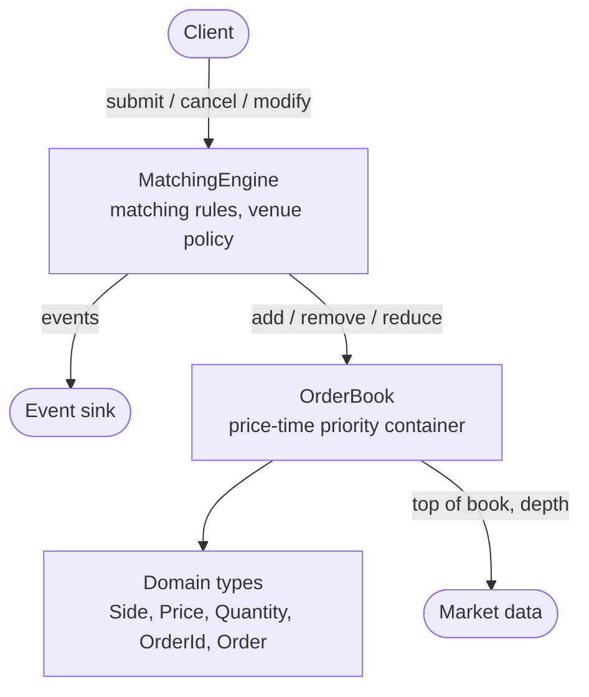

# FlashPoint

[](https://github.com/arjun2598/FlashPoint/actions/workflows/ci.yml)
[](https://en.cppreference.com/w/cpp/20)
[](LICENSE)

A limit order book and matching engine in modern C++, built the way exchange
infrastructure is: price-time priority matching, an ordered event stream, a
measured performance story, and a test suite that runs under sanitizers on every
commit.

## See it run

```
$ cmake --preset dev && cmake --build --preset dev --parallel
$ ./build/dev/demo/flashpoint_demo
```

```
3. An aggressive buy sweeps two levels
======================================
  [  8] ACCEPTED  #301  buy 900 @ 10251
  [  9] TRADE     #301 <- #101  500 @ 10250
  [ 10] TRADE     #301 <- #104  200 @ 10250
  [ 11] TRADE     #301 <- #102  200 @ 10251

            B I D S           |          A S K S
                  qty    price|    price     qty
  ----------------------------+----------------------------
        ######    400    10248|    10251     100 ##
     #########    600    10247|    10253     800 ############
           ###    200    10245|
  ----------------------------+----------------------------
  bid 10248   |   ask 10251   |   spread 3   |   5 orders resting
```

Order #101 fills before #104 at the same price, because it arrived first. The
buyer is willing to pay 10251 but pays 10250 for the first 700, because price
improvement belongs to the aggressor. Both are visible in the trade prints.

The demo runs a ten-part narrated tour by default. `-i` gives an interactive
prompt, a filename replays a script, and `--generate 2000000` runs synthetic
flow at volume.

## Quick start

Requires CMake 3.25+ and a C++20 compiler. Nothing else. GoogleTest is fetched
automatically on the first configure.

```bash
git clone https://github.com/arjun2598/FlashPoint.git
```

```bash
cd FlashPoint && cmake --preset dev && cmake --build --preset dev --parallel && ctest --preset dev
```

That is the sanitized Debug build. Substitute the `release` preset for an
optimised one. Full details in [`docs/DEVELOPMENT.md`](docs/DEVELOPMENT.md).

## What it does

| | |
|---|---|
| **Matching** | Price-time priority for limit and market orders. Sweeps multiple levels, executes at the resting order's price, preserves queue position across partial fills. |
| **Order types** | Limit and market. Market orders trade up to a venue-configured protection price derived from the opposite touch, so one cannot sweep a thin book to an arbitrary price. |
| **Time in force** | GoodTillCancel rests, ImmediateOrCancel cancels its remainder, FillOrKill checks it can fill before emitting any trade. |
| **Cancel** | Reports the quantity that was still resting, which is what the client actually pulled. |
| **Modify** | Shrinking keeps queue position, growing or repricing loses it. A reprice across the spread trades. |
| **Event stream** | Every operation publishes an ordered, sequence-numbered record: acknowledgements, executions, rejections, cancellations, amendments. One flat trivially copyable type, so a stream can be written and read back with no encoding step. |
| **Market data** | Top of book and an L2 depth snapshot that fills a caller-supplied buffer without allocating. |

## How it works



The book is a container, not a matching engine: nothing in it prevents a bid
resting above the best ask, because resolving a cross means producing a trade.
That is the engine's job, and it is the only component that can leave the book
crossed, which it never does.

Inside the book, price levels are an ordered map per side and the orders at each
level are an intrusive FIFO queue over one pooled vector. Resting an order
allocates nothing once warmed, and cancelling one is O(1) from any queue
position. [`docs/ARCHITECTURE.md`](docs/ARCHITECTURE.md) has the detail.

## Performance

Measured on an Apple M2, with the caveats stated in
[`docs/PERFORMANCE.md`](docs/PERFORMANCE.md) — it is a laptop, not a server.

| | |
|---|---|
| Read top of book | 3.1 ns, flat across book depth |
| Submit crossing one resting order | 20 ns |
| Add and cancel, sustained | 15.7 M pairs per second |
| Synthetic flow | 5.7 M operations per second over two million orders |

The performance document is worth reading for the process rather than the
numbers. It records a candidate eliminated by measurement before it was written,
an optimisation built and then reverted for producing no measurable improvement,
and the bug that negative result led to: `best_bid()` was O(log L) while
documented as O(1). Fixing it made the read paths 2.4–4.7× faster on a deep book.

## Documentation

| Document | Contents |
|----------|----------|
| [Architecture](docs/ARCHITECTURE.md) | Layering, component structure, data structures |
| [Design Decisions](docs/DESIGN_DECISIONS.md) | 45 recorded decisions: alternatives, why they lost, what each cost |
| [Performance](docs/PERFORMANCE.md) | Methodology, measurements, and what is left on the table |
| [Development](docs/DEVELOPMENT.md) | Setup, build options, running the demo and benchmarks |
| [Roadmap](docs/ROADMAP.md) | Milestone history and parked decisions |

## Engineering approach

A few choices that shape the whole project, each recorded in full in
[`docs/DESIGN_DECISIONS.md`](docs/DESIGN_DECISIONS.md):

- **All logic in a library, executables are thin.** An engine that only exists
  inside `main()` cannot be tested or benchmarked.
- **C++20 over C++23.** Ensure standard library support for others if using this project.
- **Sanitizers in CI, not as an afterthought.** An order book is a graph of
  linked nodes with manual lifetimes, hence use-after-free on a cancelled order is the
  single most likely defect here, and it is silent without ASan.
- **No performance claim without a measurement.** `docs/PERFORMANCE.md` states
  its methodology before any number exists.

## License

MIT — see [LICENSE](LICENSE).
