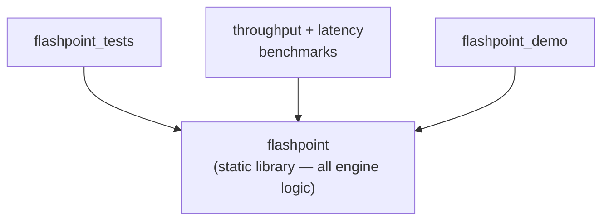
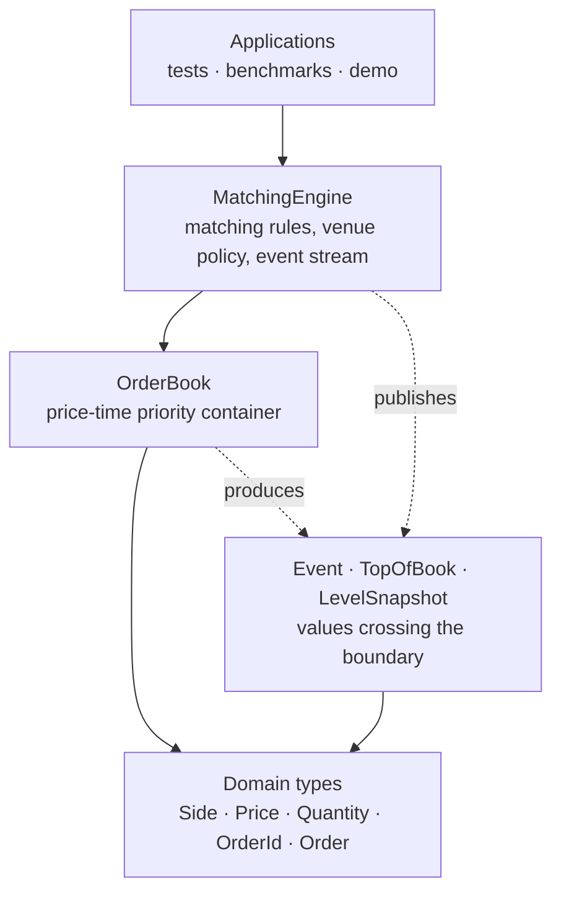
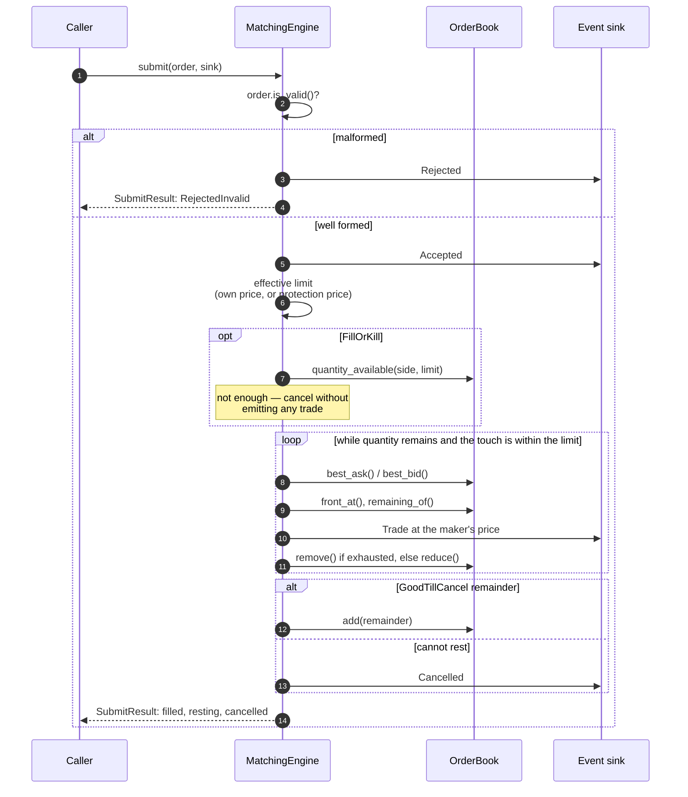

# Architecture

Every component section here was written by the milestone that built it, not
planned in advance. Where a decision is contested, this document states what was
chosen and links to [`DESIGN_DECISIONS.md`](DESIGN_DECISIONS.md) for the
alternatives and what they would have cost.

## Repository layout

```
FlashPoint/
├── CMakeLists.txt              Root build; library target, options, summary
├── CMakePresets.json           dev / release / relwithdebinfo
├── cmake/
│   ├── CompilerWarnings.cmake  Warning policy as an INTERFACE target
│   └── Sanitizers.cmake        ASan + UBSan as an INTERFACE target
├── include/flashpoint/         Public headers (the API surface)
│   ├── types.hpp               Side, Price, Quantity, OrderId
│   ├── order.hpp               Order — the inbound request
│   ├── order_book.hpp          OrderBook — price-time priority container
│   ├── trade.hpp               Trade — one execution
│   ├── event.hpp               Event — the engine's output stream
│   ├── market_data.hpp         TopOfBook, LevelSnapshot
│   ├── matching_engine.hpp     MatchingEngine — header-only (templated sink)
│   ├── ostream.hpp             Stream inserters; NOT included by the library
│   └── version.hpp.in          Generated into the build tree by CMake
├── src/                        Implementation translation units
├── tests/                      GoogleTest suite, one executable
├── benchmarks/                 Throughput (Google Benchmark) + latency harness
├── demo/                       Command interpreter, book renderer, feed generator
├── web/                        WebAssembly bindings and the browser page
├── docs/                       This directory
└── .github/workflows/ci.yml    Build matrix + format gate
```

## Build-level structure



Everything lives in the library; the executables are thin. An engine that only
existed inside `main()` could not be tested or benchmarked (DD-001).

Two INTERFACE targets carry build policy rather than global flags:

- `flashpoint_warnings` — linked `PRIVATE`, so consumers do not inherit it, and
  so `FetchContent` dependencies are never compiled under `-Werror`.
- `flashpoint_sanitizers` — linked `PUBLIC`, because sanitizer flags must appear
  on both the compile and link lines of every target in the graph.

## Layering

Dependencies point one way only. The domain types do not know the book exists,
and the book does not know the engine exists.



| Layer | Contents | Built at |
|-------|----------|----------|
| Domain types | `Price`, `Quantity`, `OrderId`, `Side`, `Order` — value types, no allocation, no I/O | Milestone 3 |
| Book | `OrderBook` — price levels, FIFO priority within a level, order lookup | Milestone 4 |
| Engine | `MatchingEngine` — applies commands to the book, produces events | Milestones 5–8 |
| Events and market data | `Event` stream, `TopOfBook`, `LevelSnapshot` | Milestone 9 |
| Applications | Tests, benchmarks, demo | Milestones 1, 10, 12 |

That direction is what keeps the book independently testable, and it is what
made the Milestone 11 tuning pass a change to the book alone with no test edits
at all.

## How an order flows through

The one path worth following end to end. Everything else in this document is a
detail of one of these steps.



Four things in that picture carry most of the design:

1. **Validation happens once, at the top.** Everything downstream, including
   `OrderBook::add`, may assume what reaches it is well formed (DD-012).
2. **The effective limit is resolved before the loop**, so limit and market
   orders share one code path rather than branching inside it (DD-025).
3. **Trades print at the maker's price.** Price improvement belongs to the
   aggressor.
4. **Fill-or-kill decides before it emits anything.** A trade handed to the sink
   cannot be withdrawn, so there is no rollback path to get wrong (DD-026).

`cancel` and `modify` follow the same shape: validate, publish what happened,
touch the book. A modify that loses queue priority re-enters the matching loop
directly rather than through `submit`, so the stream carries `Modified` rather
than a second `Accepted` for an order the client never resubmitted (DD-037).

## Component detail

### Domain types (Milestone 3)

Header-only, allocation-free, I/O-free. Every one is trivially copyable and
usable in constant expressions.

| Type | Representation | Size | Validity |
|------|----------------|------|----------|
| `Side` | `enum class : std::uint8_t` | 1 B | `is_valid(Side)` — an `enum class` does not constrain its range, and casting malformed wire data is how a third value appears |
| `Price` | signed `std::int64_t` ticks | 8 B | none — every value is a legitimate price, including negative (DD-009) |
| `Quantity` | unsigned `std::uint64_t` | 8 B | `is_valid()` — zero is the only malformed state; negatives are unrepresentable |
| `OrderId` | unsigned `std::uint64_t` | 8 B | `is_valid()` — zero is reserved as "no order" |
| `Order` | the four above | 32 B | `is_valid()` — structural only |

Three properties are worth stating explicitly, because later milestones depend
on them and the tests enforce all three:

- **The types are not interconvertible.** Each constructor is `explicit`, so a
  raw integer cannot become a `Price`, and a `Quantity` cannot be passed where a
  `Price` belongs. `Order`'s constructor takes price and quantity adjacently;
  transposing them fails to compile rather than mispricing an order (DD-010).
- **`Order` is trivially copyable and exactly 32 bytes**, so two orders share a
  64-byte cache line. Both are asserted, the size in `tests/order_test.cpp` as a
  deliberate performance regression test.
- **Each type exposes its representation as a nested `Rep` alias.** Narrowing
  `Price::Rep` to 32 bits is a possible future extension, and this makes it a
  one-line change here rather than an edit at every use site. This is a concrete
  payoff of the wrapper over a bare typedef.

`Order` models the *inbound request*: immutable, no remaining quantity, no
timestamp. The representation the book stores for a resting order is a Milestone
4 design, once the book exists to constrain it (DD-011).

### Order book (Milestone 4)

`OrderBook` holds one instrument's resting orders in price-time priority. It is a
container, not a matching engine: nothing here prevents a bid resting above the
best ask, because resolving a cross requires producing a trade, which is the
engine's job at Milestone 5.

**Structure.** Two layers, chosen independently and for different reasons:

```
    bids_ : map<Price, Level, greater>   asks_ : map<Price, Level, less>
                │   each ordered best-first, so begin() is the touch
                │   on both sides. See DD-042: rbegin() was not O(1).
                ▼
    Level { head, tail, total, count }
                │   intrusive doubly-linked FIFO queue of
                │   indices into one pooled vector
                ▼
    nodes_ : vector<Node>        Node { id, remaining, prev, next }   24 B
                ▲
                └── free_head_ : freed slots form a stack threaded
                    through the nodes' own `next` field

    index_ : unordered_map<OrderId, Locator{ node, price, side }>
```

**Complexity.** L is the number of distinct price levels, not orders.

| Operation | Cost | Where the cost is |
|---|---|---|
| `add` | O(log L) | level lookup; the append itself is O(1) |
| `remove` | O(log L) | level lookup; finding and unlinking the order is O(1) |
| `best_bid` / `best_ask` | O(1) | `begin()` on both sides (DD-042) |
| `quantity_at` / `order_count_at` / `front_at` | O(log L) | level lookup; aggregates are cached, so no queue walk |

Every O(log L) term comes from the price-level container and nothing else. This is so that it localises the entire
remaining cost to the one component needing to be tested at Milestone 11 (DD-015).

**Two invariants worth naming**, because violating either produces wrong answers
rather than merely slow ones:

- **Empty levels are erased, never retained.** A retained empty level would make
  `best_bid()` report a price with no depth behind it.
- **Level aggregates are maintained incrementally**, so depth queries never walk
  the queue. They must be updated on every mutation or they silently drift.

**Interface contract.** Every accessor returns a value or an `OrderId`, but never an
iterator or a reference into the book (DD-018). This is what allows the
price-level container to be replaced without touching a caller, and it is
asserted in tests rather than merely documented.

### Matching engine (Milestone 5)

`MatchingEngine` owns a book and applies incoming limit orders to it. It is the
only component that can leave the book crossed, and it never does which is why
`OrderBook` contains no crossing check of its own.

**The loop:**

```
submit(order, on_trade):
    reject if structurally invalid        ← the boundary check DD-012 promised
    reject if the id is already resting
    while the order has quantity left:
        touch = best price on the opposing side
        stop if there is none, or it is beyond the order's limit
        maker = front order at the touch          (oldest wins)
        fill  = min(aggressor remaining, maker remaining)
        emit Trade at the MAKER's price
        fill == maker remaining ? remove(maker) : reduce(maker, fill)
    rest any remainder
```

**Three rules that carry the correctness of this milestone:**

1. **Execution price is the maker's price.** A buy limited at 105 lifting an ask
   resting at 100 trades at 100, meaning price improvement accrues to the aggressor.
   Reversing this overcharges every taker while every quantity still balances.
2. **A partial fill preserves queue position.** `OrderBook::reduce` leaves the
   order's links untouched. Sending a partially filled order to the back of the
   queue would leave aggregate depth identical and show up only in the ordering
   of later executions (DD-022).
3. **Equality crosses.** A limit exactly at the resting price trades, on both
   sides. One tick short does not.

**Termination.** Both sides of every fill are strictly positive, so the book never
retains a zero-quantity order. `fill > 0` always and the loop makes progress
on every iteration.

**Trade delivery** is a caller-supplied sink invoked once per execution
(DD-019), so a non-marketable order costs nothing and a sweep allocates nothing.
This is the seam Milestone 9's event stream will attach to.

### Market orders and time-in-force (Milestone 6)

`Order` carries an `OrderType` and a `TimeInForce`. Both are one byte and fit in
`Order`'s existing padding, so it is still 32 bytes.

**Effective limit.** The engine resolves one price before matching starts:

| Order type | Effective limit |
|---|---|
| Limit | the order's own price |
| Market | opposite touch at arrival, ± `market_protection_ticks` |

The matching loop then runs unchanged for both. A market order with nothing
resting opposite has no touch to measure from and nothing to trade against, so
it is cancelled in full.

Protection saturates at the ends of the price range rather than wrapping.
Overflowing a signed integer is undefined behaviour, and a test drives a market
order against a level at the maximum representable price to prove the guard
holds.

**What happens to the remainder:**

| Time-in-force | Remainder |
|---|---|
| GoodTillCancel | rests in the book |
| ImmediateOrCancel | cancelled |
| FillOrKill | the order fills completely or does nothing |

Market orders can never rest, so `Market` + `GoodTillCancel` is rejected as
malformed.

**Fill-or-kill** checks `OrderBook::quantity_available()` before matching. A
trade handed to the sink cannot be withdrawn, so the decision has to be made
before any trade is emitted rather than rolled back afterwards (DD-026).

**Reporting.** `SubmitResult` is `{status, filled, resting, cancelled}`. For any
accepted order the three quantities sum to what was submitted. `status` says
whether the order was accepted; the quantities say what became of it.

### Cancel (Milestone 7)

`MatchingEngine::cancel(OrderId)` returns `CancelResult{status, cancelled}`.

The book's `remove()` already existed from Milestone 4, where the need for O(1)
removal drove the intrusive-queue design. Milestone 7 adds the protocol around
it: validation, rejection reasons, and reporting.

| Status | Meaning |
|---|---|
| `Cancelled` | the order was resting and is now gone |
| `UnknownOrder` | nothing with that id is resting |
| `RejectedInvalidId` | the id was `OrderId::kNone`, the reserved "no order" value |

Two notes:

- **The reported quantity is what was left, not the original size.** An order
  that filled 30 of 50 before the cancel reports 20. `cancel` reads
  `remaining_of()` before removing for exactly this reason.
- **`UnknownOrder` is deliberately coarse.** It covers "never existed", "already
  filled", and "already cancelled", because the book only knows what is resting
  now. Distinguishing them needs an order-history subsystem (DD-029).

There is no owner check. Any caller can cancel any order, because `Order` has no
participant id. Same gap as self-trade prevention, parked for the same reason.

### Modify (Milestone 8)

`MatchingEngine::modify(id, new_price, new_quantity, on_trade)` returns
`ModifyResult{status, filled, resting, priority}`. The order keeps its id.

**Queue priority** is the substance of this milestone:

| Change | Priority | What happens internally |
|---|---|---|
| quantity reduced, same price | retained | `OrderBook::reduce`, links untouched |
| quantity unchanged, same price | retained | nothing |
| quantity increased | lost | remove, then re-submit |
| price changed | lost | remove, then re-submit |

Shrinking takes nothing from the orders behind, so the order stays put. Growing
it adds size ahead of orders already waiting, so it goes to the back.

**`new_quantity` is the new remaining quantity**, not a new total order size.
The book stores only the remainder (DD-017), so a FIX-style total would need an
extra field on the hottest object in the book. The priority comparison follows:
"increased" means larger than what is currently resting.

**A repriced order goes back through `submit()`**, so one that now crosses the
spread trades, exactly as a fresh order at that price would. That keeps the
matching rules in one place, and keeps the no-crossed-book guarantee for modify
as well as submit.

Supporting this, `OrderBook` gained `resting_order(OrderId)`, which returns a
`RestingOrder` snapshot — side, price and remaining quantity by value. It is a
copy, not a view, so it fits the handle-based contract (DD-018).

### Event stream and market data (Milestone 9)

Every mutating engine call takes an event sink and publishes what it did, in
order. The result types (`SubmitResult`, `CancelResult`, `ModifyResult`) remain
as summaries of the same information.

**What each operation publishes:**

| Operation | Events, in order |
|---|---|
| order that rests untouched | `Accepted` |
| order that trades | `Accepted`, then one `Trade` per execution |
| IOC or market with a remainder | `Accepted`, trades, `Cancelled` |
| FOK that cannot fill | `Accepted`, `Cancelled` — no trades at all |
| anything malformed | `Rejected` alone |
| `cancel` | `Cancelled`, or `Rejected` |
| `modify` | `Modified`, then trades if the reprice crossed |

**A modify never publishes a second `Accepted`.** Internally, a modify that loses
priority removes the order and re-adds it, which is a submit. The matching core
was split into a private `apply()` so `submit` and `modify` can each publish
their own acknowledgement and share everything after it. A consumer
reconstructing order state from the stream would otherwise count the order twice
(DD-037).

**`Event` is one flat record** with an `EventType` tag rather than a variant of
five shapes. It is trivially copyable and fixed size, so the stream can be
written to a file and read back with no encoding step. `event.hpp` documents which
fields each type populates.

**Sequence numbers** start at 1 and increase by one per event, including for
rejections. That is what lets a consumer detect a gap. Scope is one engine, so
one instrument.

**Market data** comes from two book methods:

- `top_of_book()` returns best price and quantity on each side, plus the spread
  in ticks.
- `snapshot(Side, std::span<LevelSnapshot>)` fills a caller-supplied buffer with
  the best price levels, best first, and returns how many it wrote. Orders at one
  price aggregate into a single row with a count, which is what makes it level 2
  rather than level 3.

The caller owning the buffer means a publisher reuses one array across thousands
of snapshots without allocating, and sizing the span is how it chooses the depth
(DD-038).
